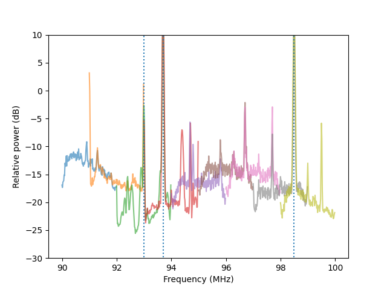
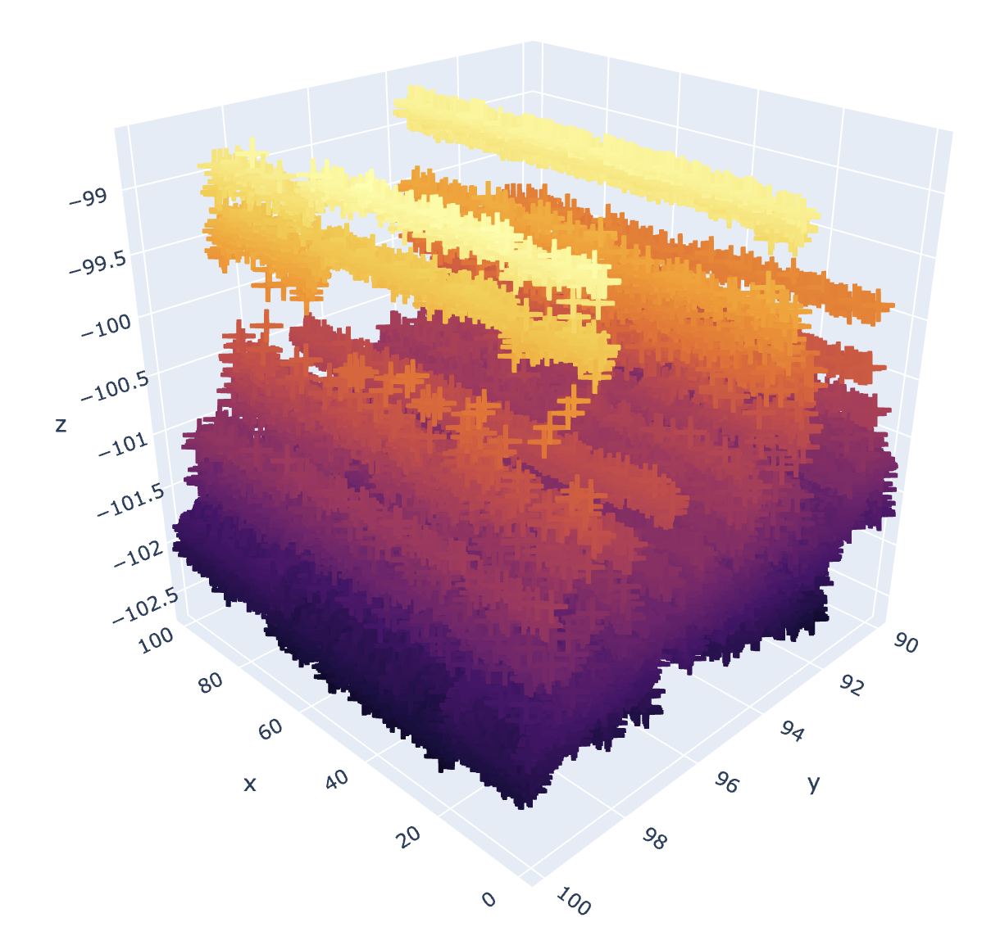
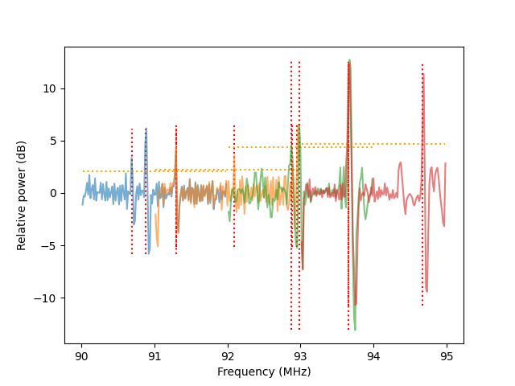
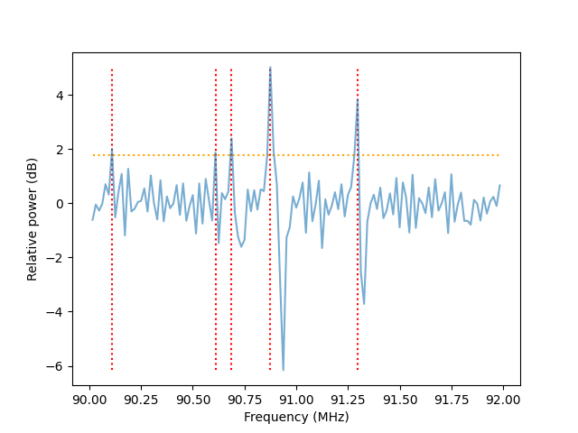

# ML SDR

Just another approach to do machine learning stuff on software defined radio. 2D/3D Scanner included.

``rtl - sdr - gqrx - pyrtlsdr - python - machine learning - scanner``

Author: [Maximilian Bundscherer](https://bundscherer-online.de)

## Overview

*GQRX sample*

*Included 2d scanner*

*Included 3d scanner*

### Features

- **Mode 1**: Python sdr scanner controller ([gqrx](https://gqrx.dk/) client)
- **Mode 2**: Python sdr experiments (2d and 3d scanner) ([pyrtlsdr](https://pyrtlsdr.readthedocs.io/en/latest/) api)
- **Mode 3**: Python sdr sender locator ([pyrtlsdr](https://pyrtlsdr.readthedocs.io/en/latest/) api and gqrx client)

### Requirements

- [GQRX](https://gqrx.dk/) (only mode 1 and 3 - comfort)
- Python (pip requirements included) (3.9 recommend)

### Mode 1: GQRX Client

- Create virtual python env
- Install requirements (see script in ``python/``)
- Enable remote control in gqrx
    - Set port ``7356``
    - Add ``localhost``, ``0.0.0.0`` to allowed hosts
- Run python file in ``python/src/gqrx-sdr-scanner.py``

### Mode 2: 2D/3D Scanner (pyrtlsdr)

- Create virtual python env
- Install requirements (see script in ``python/``)
- **2D Scan**: Run python file in ``python/src/pyrtlsdr-2d-scanner.py``
- **3D Scan**: Run python file in ``python/src/pyrtlsdr-3d-scanner.py``

### Mode 3: Sender locator (pyrtlsdr)

- Create virtual python env
- Install requirements (see script in ``python/``)
- Enable remote control in gqrx
  - Set port ``7356``
  - Add ``localhost``, ``0.0.0.0`` to allowed hosts
- Run python file in ``python/src/pyrtlsdr-sender-locator.py``