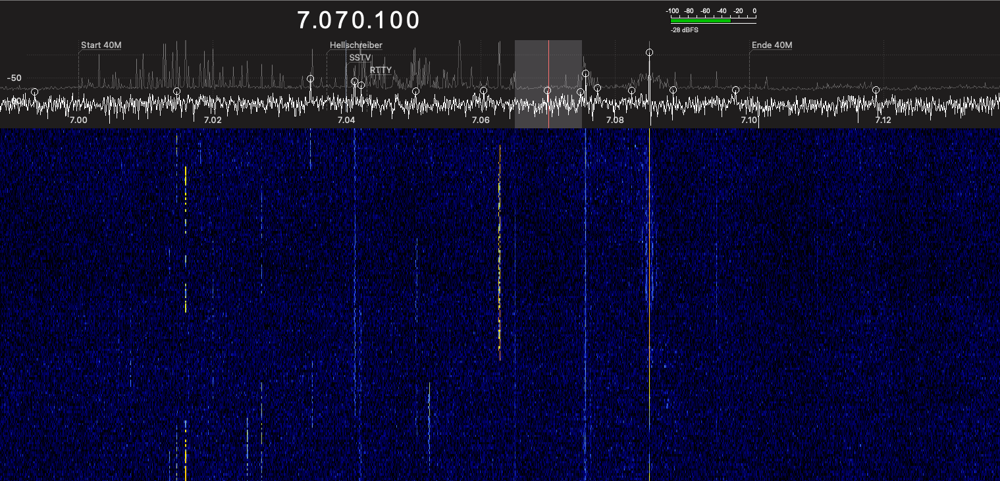
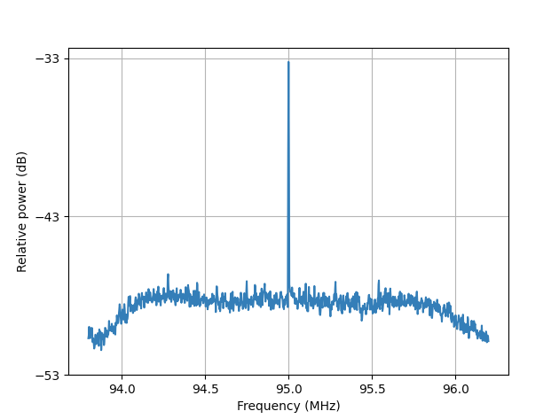

# ML SDR

Just another approach to do machine learning stuff on software defined radio.

``sdr - machine learning``

Author: [Maximilian Bundscherer](https://bundscherer-online.de)

## Overview

### Features

- **Mode 1**: Python sdr scanner controller ([gqrx](https://gqrx.dk/) client)
- **Mode 2**: Python sdr experiments ([pyrtlsdr](https://pyrtlsdr.readthedocs.io/en/latest/) api)
- tbd (work in progress)

### Requirements

- [GQRX](https://gqrx.dk/) (only mode 1)
- Python (pip requirements included) (3.9 recommend)

### Mode 1 (Gqrx Sdr Client)

- Create virtual python env
- Install requirements (see script in ``python/``)
- Enable remote control in gqrx
    - Set port ``7356``
    - Add ``localhost``, ``0.0.0.0`` to allowed hosts
- Run python file in ``python/src/gqrx-sdr-scanner.py``

### Mode 2 (pyrtlsdr)

- Create virtual python env
- Install requirements (see script in ``python/``)
- Run python file in ``python/src/pyrtlsdr.py``
